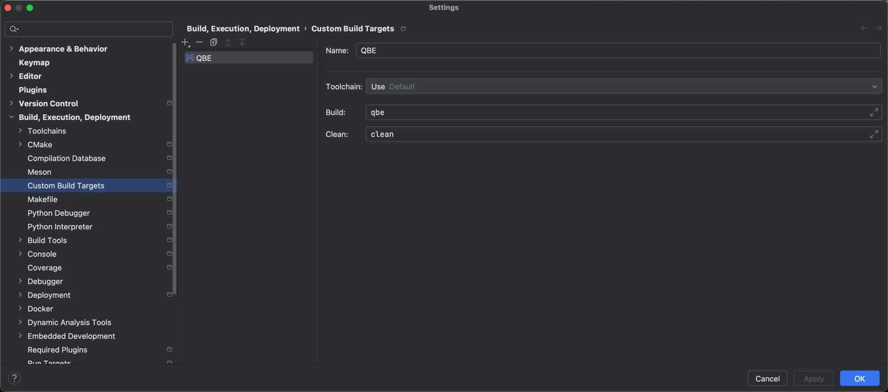
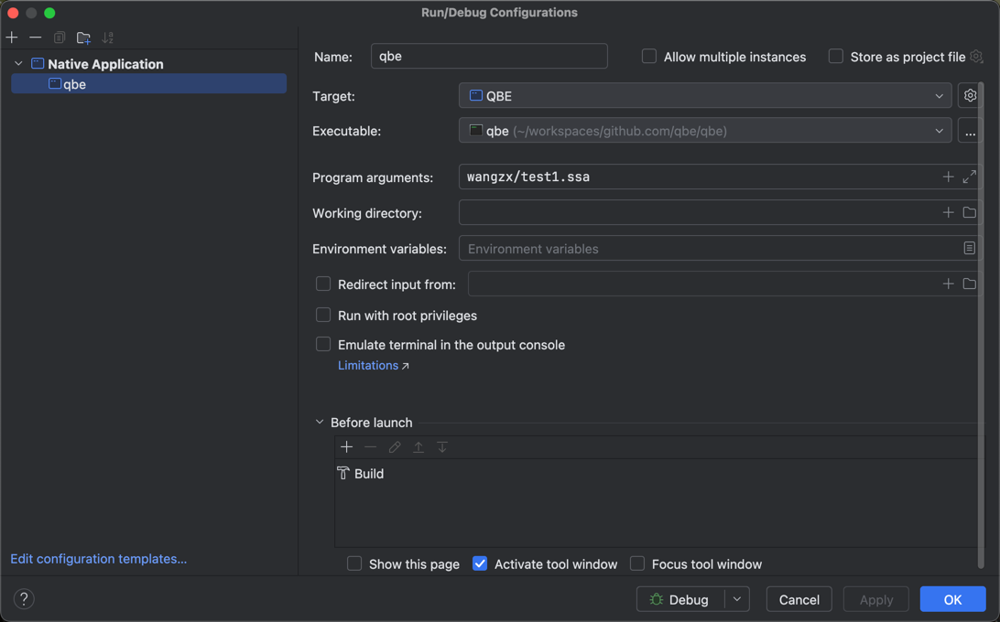

# debug in clion

1. setting - Build, Execution, Deployment - Custom Build Targets
    - add Make target: QBE
      Toolchain: Use default
      Build: qbe
      Clean: clean
   

2. Add Native Application
  Target:  QBE <reference: custom Build Target QBE>
  executable: ./qbe
  program arguments: wangzx/test1.ssa
  

Then debug works.

## TODO
- use debug to understand the code
- first understand the top level flow
- then understand the core data structure.
- then understand each part's algorithm. (有选择的看)

## 2025-02-27
